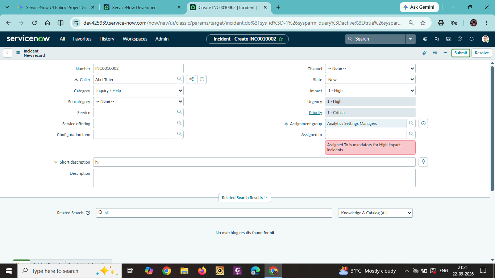
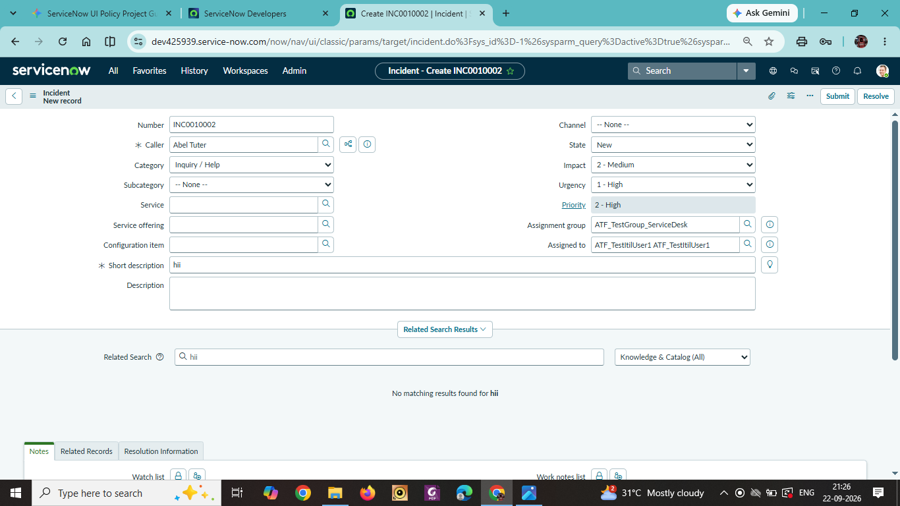

# Phase 6: Project Testing

## Overview
This document outlines the test cases, execution steps, and verification results for the UI Policies and Client Scripts configured on the Incident table.

---

## Unit Test Cases

### Test Case 1: Mandatory Assigned To Field Validation
* **Feature:** Mandatory "Assigned To" Field
* **Pre-condition:** Open a new or existing incident form (`incident.do`).
* **Test Steps:**
  1. Set `Impact` to `1 - High`.
  2. Leave the `Assigned to` field empty.
  3. Attempt to save or submit the form.
* **Expected Result:** The system blocks form submission and displays the red error message: *"Assigned To is mandatory for High impact incidents"*.
* **Status:** Passed

---

### Test Case 2: Auto-Set Urgency to High Validation
* **Feature:** Auto-Set Urgency & Read-Only Logic
* **Pre-condition:** Open an incident form where `Impact` is set to Medium or Low.
* **Test Steps:**
  1. Change `Impact` to `1 - High`.
* **Expected Result:** `Urgency` automatically changes to `1 - High` and becomes read-only.
* **Status:** Passed

---

### Test Case 3: Reverse Condition Logic (Impact Change)
* **Feature:** `onChange` Client Script for Urgency Field
* **Pre-condition:** Incident `Impact` is currently set to `1 - High`.
* **Test Steps:**
  1. Change `Impact` from `1 - High` to `2 - Medium`.
* **Expected Result:** The `Urgency` field becomes editable again.
* **Status:** Passed

---

### Test Case 4: Block List Editing on State Field
* **Feature:** `onCellEdit` Client Script on State Field
* **Pre-condition:** Navigate to the Incident list view (`incident.list`).
* **Test Steps:**
  1. Double-click the `State` cell for any incident in the list view.
  2. Attempt to edit the value.
* **Expected Result:** An alert popup appears stating *"State cannot be updated using list editing. Please open the Incident."* and the change is canceled.
* **Status:** Passed

